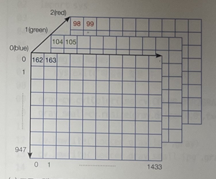
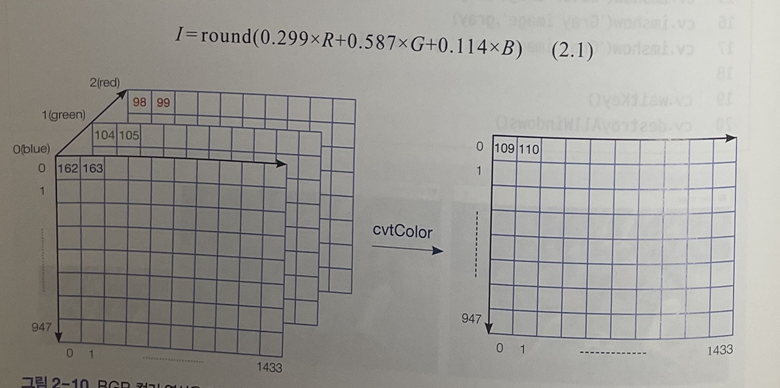

# CH2 ) OpenCV로 시작하는 컴퓨터 비전
    
>## 객체지향 잘 활용하기
- 객체는 .을 찍어 자신이 가진 함수를 능동적으로 호출
  - 멤버 함수 or 메서드라 불림

- 객체 확인하기
  - type(a) : a가 어떤 클래스에 속하는지 알 수 있음
  - dir(a) : a가 가진 메서드를 모두 알 수 있음
  - help(a) : a가 지닌 메서드의 정보(무슨 일을 하는지, 어떻게 사용하는지)를 알 수 있음
    - help(a.sort()) : sort()의 정보만 알 수 있음

            numpy.ndarray 클래스 형의 객체를 만들고 멤버    함수 적용하기
            import numpy as np
            a=np.array([4,5,0,1,2,3,6,7,8,9,10,11])
            print(a)
            print(type(a))
            print(a.shape)
            a.sort()
            print(a)
            b=np.array([-4,-3,-2.3,12.9,8.99,10.1,-1.2])
            b.sort()
            print(b)
            c=np.array(['one','two','three','four','five','six','seven'])
            c.sort()
             print(c)

            
>## 영상을 읽고 표시하기

    #영상 파일을 읽고 윈도우에 디스플레이하기 
    import cv2 as cv
    import sys

    img=cv.imread('catt.jpg') #영상 읽기

    if img is None:
      sys.exit('Not find file')
    
    cv.imshow('Image Display',img) #윈도우에 영상 표시
    #cv.waitKey(10000) :10초를 기다리는 것
    cv.destroyAllWindows() #모든 윈도우를 닫음

>## pixel (화소)

- 화소(pixel) 
  - 영상을 구성하는 한 점
  - 화소의 위치 : (행 좌표, 열 좌표)(r,c)로 표기
      - 행 좌표는 y축, 열 좌표는 x축에 해당
  - 왼쪽 위를 원점으로 간주
  - 채널은 RGB가 아닌 BGR 순서
  - img.shape = (948,1434,3)인 경우
    -    

           #black_cat 으로 해본 결과 img.shape = (784, 649, 3)
           import cv2 as cv
           import sys

           img=cv.imread('catt.jpg') #영상 읽기

           print(type(img))
           print(img.shape)
           print(img[0,0,0],img[0,0,1],img[0,0,2]) #(0,0)화소 조사
           print(img[340,300,0],img[340,300,1],img[340,300,2]) #(340,300)화소 조사

>## 영상 형태 변환 & 크기 축소
    import cv2 as cv
    import sys

    img=cv.imread('catt.jpg') #영상 읽기

    if img is None:
      sys.exit('Not found file')
    
    #BGR 컬러 영상을 명암 영상으로 변환
    gray=cv.cvtColor(img,cv.COLOR_BGR2GRAY)

    #반으로 축소
    gray_small=cv.resize(gray,dsize=(0,0),fx=0.5,fy=0.5)

    #영상을 파일에 저장 
    cv.imwrite('catt_gray.jpg',gray) #영상을 파일에 저장 
    cv.imwrite('catt_gray_small.jpg',gray_small)

    cv.imshow('Color image',img)
    cv.imshow('Gray image',gray)
    cv.imshow('Gray image small',gray_small)

    cv.waitKey()
    cv.destroyAllWindows()

- cvtColor 함수 : 컬러 영상 -> 명암 영상
     -  cvtColor(입력 영상, 이미지를 그레이스케일로 변환)
     -  컬러 변환을 위한 일반화 식 
         
     - cv.COLOR_BGR2GRAY : BGR로 표현된 컬러 영상을 명암으로 변환하라고 지시
- resize 함수 : 영상의 크기를 변환
  - cv.resize(입력 영상, 변환할 크기 지정)
    - dsize : 변환할 크기 지정 (dsize=(0,0)인 경우 fx,fy를 따른다는 의미)
    - fx=0.5, fy=0.5 : 가로와 세로 방향 모두 반으로 축소
